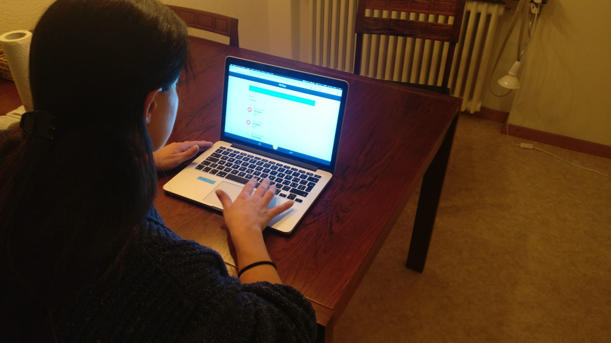

# PitStop

## Live-Version

Eine Version der App ist unter https://pitstop-app.ch/ verfügbar.

### Account mit Beispiel-Daten

Folgender Account kann verwendet werden, um die App mit Beispiel-Daten zu testen:

```
E-Mail: beispiel@pitstop-app.ch
Passwort: beispiel
```

## Installation

1. Repo klonen
2. In das `pitstop` Verzeichnis wechseln `npm install` ausführen
3. `npm start` ausführen
4. http://localhost:3001 aufrufen (falls dies nicht automatisch im Browser geöffnet wird)

## Features

* Progressive Web App
* Mobile-first und responsive Design
* Komplett eigenes UI (kein Framework)
* Usability-gestestet (Bild folgt)
* Formularvalidierung bei Eingabe

## Verwendete Libraries

* React & Redux (für Single Page Applikation)
* Formik & Yup (für Formulare und Validierung)
* Enzyme & Jest (für Unit-Tests)
* Chart.js (für Statistik-Grafiken)
* Moment.js (für Datumsformate)
* Normalize.css (konsistente Darstellung auf allen Browsern)
* BEM (CSS Naming Convention)

## Projektumfang

### Modul 1: Benutzerkonten
Zur Nutzung der Fahrzeugverwaltung ist ein Benutzerkonto erforderlich.

### Modul 2: Security
Login / Logout

### Modul 3: Fahrzeuge verwalten
Verwaltung von Fahrzeugen mit diversen Attributen: Marke, Modell, Baujahr, Kennzeichen etc.

### Modul 4: Fahrzeug-Logbuch
Logbuch pro Fahrzeug zum Erfassen von Ereignissen: Reifenwechsel, Service, Reparatur, Tankfüllung, Ölwechsel, Ölnachfüllung etc.

### Modul 5: Statistik
Statistik pro Fahrzeug: Benzin- & Ölverbrauch, Unterhaltskosten, Kilometerleistung der Reifen etc.

### Usability Test Beweisfoto


